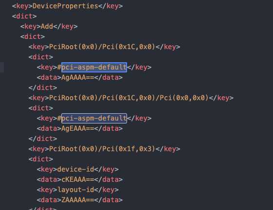

# XiaoXinPro13-AX201
XiaoXInPro 2020 intel i5 SN550 AX201
#编写中

## 前言

本机为小新pro13 2020 i5版本，随机自带固态为三星pm981a，已更换为SN550，网卡为AX201
### 在阅读本文前，首先感谢前人
https://github.com/Hush-vv/Lenovo-XiaoXinPro13-Hackintosh  
https://github.com/daliansky/XiaoXinPro-13-hackintosh  
等等做的贡献，其实安装的方法已经有很多人给出教程了
## 我的安装步骤
### 1.在windows 下刷入测试版的BIOS，或通过软件修改BIOS设置
参考文献：https://derrors.cn/hackintosh/dvmt-cfglock.html  
方法1：   
联想小新 Pro13 的 DVMT Pre-Allocated 的默认数值为 32M，而 macOS 系统里检查 DVMT 值需要至少 64M，因此需要修改 BIOS 里 DVMT Pre-Allocated 数值  
方法2：  
刷入内测版BIOS，直接在开机进入的BIOS中修改
#### 1.1BIOS必须要修改吗？
#### 答：必须要，两种方法二选一#### 1.1BIOS必须要修改吗？
#### 答：必须要，两种方法二选一

#### 1.2我已经安装到一半了，或者windows系统已经格式化了，怎么办？
#### 答：进PE系统，再操作

### 2.刻录MAC OS系统盘  
在windows系统下，通过balenaEtcher https://etcher.io/ 软件刻录U盘，做好系统盘

### 3.修改BIOS设置  
Secure Boot 设置为Disabled

### 4.安装系统
开机时按住FN和F12键盘，选择你的U盘启动，进入安装画面，安装系统，可能会有3次重启过程

### 5.重建缓存
安装完成后，进入系统之后重建缓存，方便触摸板等生效
输入命令：
sudo spctl --master-disable
sudo kextcache -i /

### 6.替换EFI
通过命令行或者软件，如clover configurator等软件挂载系统自带的EFI分区，将适合小新pro13的FEI文件夹替换到其中

### 7.AX201使用网络
AX201由于前人的努力，已经实现了提取linux下驱动封装并使用。
如果你的小新pro13也是AX201网卡，那你应该目前只有网络不正常无法使用。
#### 7.1下载驱动
下载Wi-Fi 驱动下载：  
https://github.com/OpenIntelWireless/itlwm/releases  
蓝牙 驱动：  
https://github.com/OpenIntelWireless/IntelBluetoothFirmware/releases  
HeliPort 客户端：  
https://github.com/OpenIntelWireless/HeliPort/releases
#### 7.2挂载系统EFI安装驱动，安装软件
下载后将驱动放入EFI下的OC/kexts，并安装HeliPort作为无线网连接软件
#### 7.3屏蔽
编辑OC/config.plist以pci-aspm-default为关键字找到这两行并通过#屏蔽
  
保存并重启
#### 7.4配置
打开系统偏好设置，选择网络，添加“以太网”，点击应用，使用Heliport连接无线网
